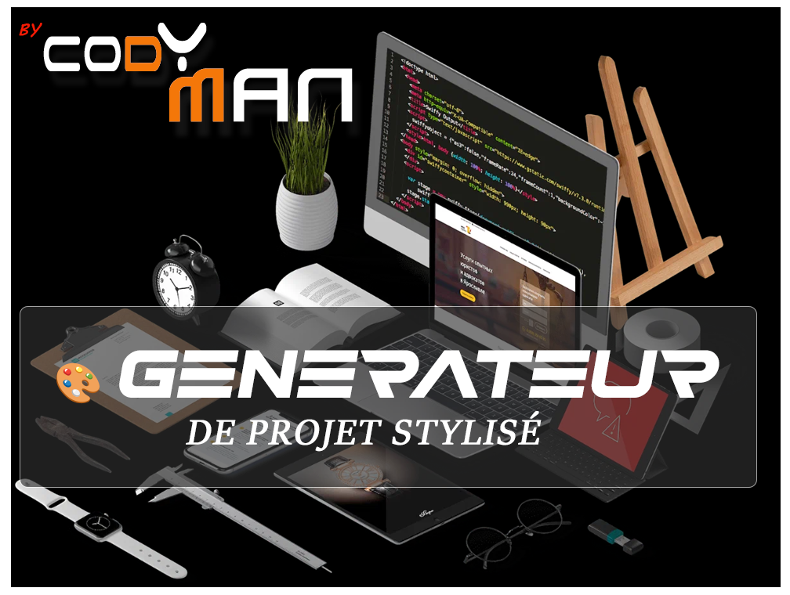

# 🎨 Générateur de Projet Stylisé

<div align="center">




</div>

## ✨ Description

> Un assistant interactif qui transforme vos idées en projets web élégants !

Créez rapidement des projets web modernes avec une structure optimisée et un style visuel professionnel. Notre générateur vous guide à travers une série de choix pour personnaliser votre projet selon vos besoins.

## 🚀 Démarrage Rapide

```bash
# Lancer le générateur
node creation_projet.js
```

## 🎯 Fonctionnalités

### 📝 Configuration Interactive

<details>
<summary>Informations de Base</summary>

- 📌 **Nom du projet** - L'identité de votre création
- 📄 **Description** - L'essence de votre projet
- 👤 **Auteur** - Votre signature
</details>

<details>
<summary>Type de Projet</summary>

- 🌐 **Web** - Applications web modernes
- 🖥️ **Desktop** - Applications natives
- 🔌 **API** - Services web RESTful
- 📚 **Bibliothèque** - Composants réutilisables
- ✨ **Autre** - Projets spéciaux
</details>

### 🎨 Styles Visuels

<details>
<summary>Designs Modernes</summary>

| Style | Description |
|-------|-------------|
| 🟦 **Material Design** | Design épuré façon Google |
| ⬜ **Minimalist** | Simplicité et élégance |
| 🔲 **Neomorphism** | Effet 3D subtil et moderne |
| 📺 **Retro/Vintage** | Charme des années 80-90 |
| 🌊 **Organic** | Formes fluides et naturelles |
| 🔍 **Glassmorphism** | Effet verre dépoli élégant |
| ⬛ **Brutalist** | Design audacieux et brut |
| 💫 **Cyberpunk** | Futuriste et néon |
</details>

### 🛠️ Frameworks CSS

<details>
<summary>Outils de Style</summary>

| Framework | Avantages |
|-----------|-----------|
| 🌪️ **Tailwind** | Développement rapide et flexible |
| 🅱️ **Bootstrap 5** | Composants riches et responsive |
| 🎈 **Bulma** | Moderne et léger avec Flexbox |
| 🏗️ **Foundation** | Professionnel et personnalisable |
| 🎨 **Custom CSS** | Contrôle total du design |
| 📱 **Sass/SCSS** | Organisation optimale des styles |
| 🧩 **CSS Modules** | Styles isolés par composant |
| 💅 **Styled Components** | Styles dynamiques en JS |
</details>

## 📂 Structure Générée

La structure de votre projet sera optimisée selon vos choix de style et de framework. Chaque fichier est soigneusement placé pour une organisation claire et efficace.

## 💡 Contribution

Vos idées et contributions sont les bienvenues ! N'hésitez pas à :
- 🐛 Signaler des bugs
- 💫 Proposer des fonctionnalités
- 🔧 Soumettre des pull requests

## 📜 Licence

Ce projet est sous licence MIT - voir le fichier LICENSE pour plus de détails.

---

<div align="center">
  
### 🌟 Créez des projets exceptionnels !

</div>
